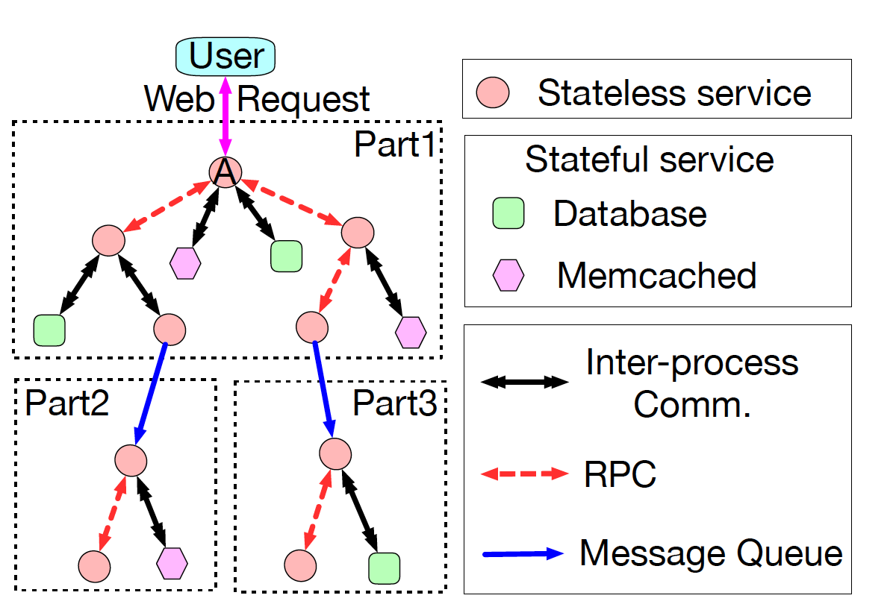
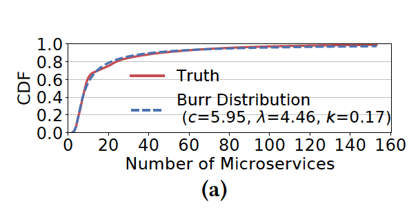
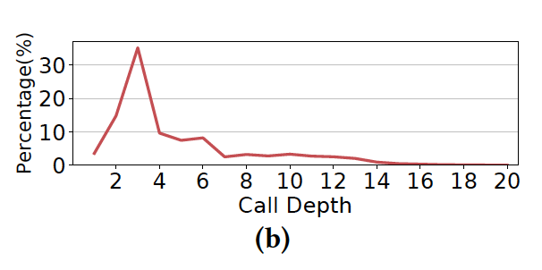
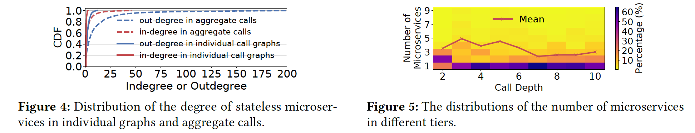
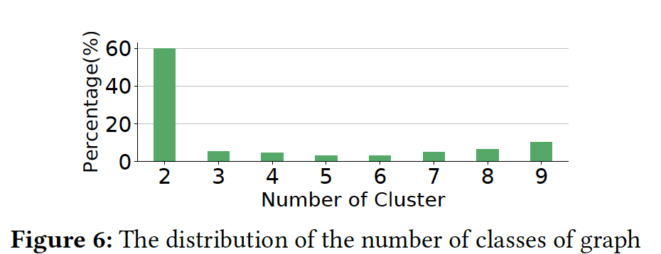
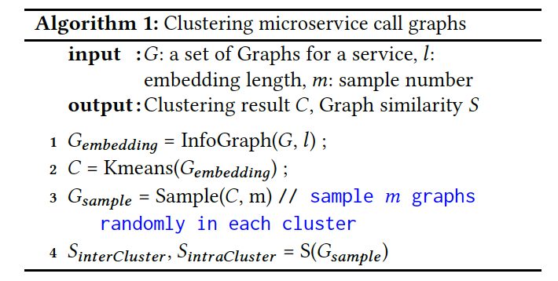
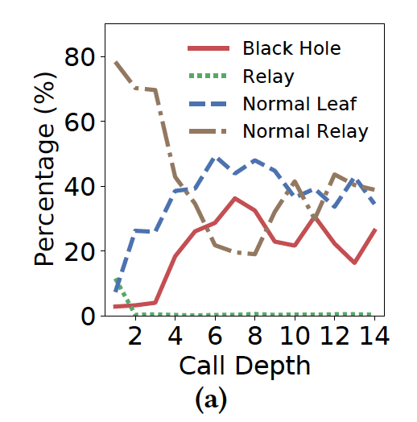
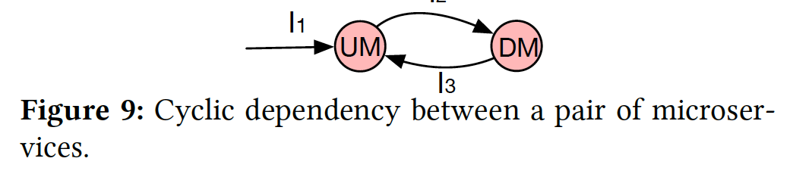
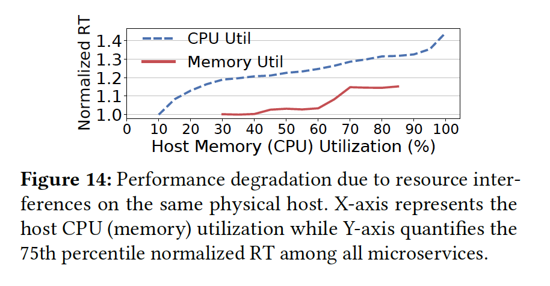
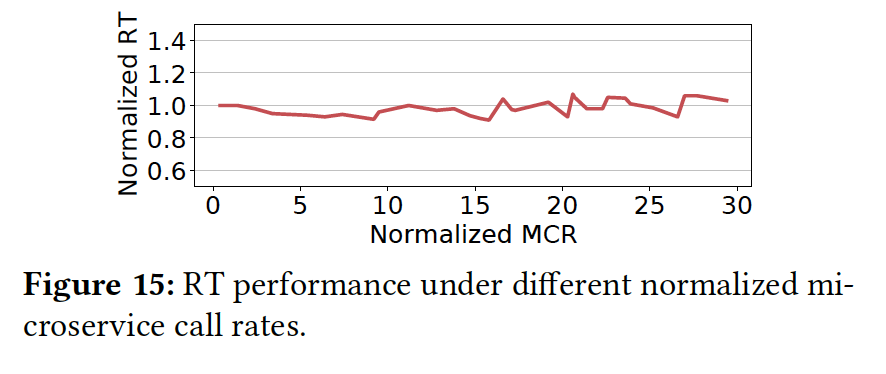

Their trace data is here: https://github.com/alibaba/clusterdata/s

1. Like Meta, they mention that the benchmark suits in the domain only provide insights into relatively small-scale clusters [no. services < 40]. The results do not necessarily apply to production environments.
- another limitation of these works: each service keeps a fixed call graph topology that does not change often when different requests are being processed.
2. Finding: Microservice call graphs are substantially different from traditional DAGs of data-parallel jobs. Reasons are: 
- The size of microservice call graphs follows a heavy-tail distribution
- A microservice call graph is topologically similar to a tree. [trees are DAGs but each child has only 1 parent]
- A non-negligible fraction of microservices are hot-spots [microservices are being multi-plexed by lots of services]. [traditional DAG graphs do not share nodes with each other.]
- Microservices can form highly dynamic call dependencies in runtime. [Traditional DAG graphs tend to be static and do not change after a job is submitted] Example: the same online service can have more than nine classes of topologically different graphs. 
3. Finding: Strong dependency between microservices provides
good opportunities for optimization of microservice
designsStrong dependency between microservices provides good opportunities for optimization of microservice designs. [coupling the dependant pairs of microservices]
- A noticeable fraction of microservice pairs have a strong coupled dependency. For such pairs, the upstream (UM) one will repeatedly call the downstream(DM) one multiple times whenever the UM is called by others => Coupling these interfaces with a strong dependency may help to greatly reduce the communication overhead.
4. Microservice performance is much more sensitive to CPUinterference than memory interference. 
5. Response Time (RT) of microservices are highly graph topology dependent.
6. In the call graphs, there are 3 different types of communication links

- inter-process communication (IP) -> usually between stateless and stateful
- remote invocation  (RPC) -> two-way communication such that DM must return a
result to the UM
- indirect communication (like Message Queue (MQ)) [one-way only]
7. Running environmen:
- Microservices run in containers, that are managed by Kubernetese.
- Stateful services [like database and memcached] are deployed in a cluster, not shared with other stateless services or batch applications.
8. They keep track of type of communication between the services.
- RPC, MQ and IP account for 76%, 23% and 1% of communication paradigms respectively.
- takeaway: MQ contributes to a non-negligible percentage of calls in production clusters, which is quite different from the synthetic benchmarks in academia. 

## Topology of Call Graphs
1. The size of microservice call graphs follows a heavy-tail distribution. [a non-negligible number of graphs are big and deep.]

2. For those call graphs of large size (containing more than 40 microservices), about 50% of their microservices are Memcacheds. -> Reason: because maintaining a large number of Memcacheds can significantly reduce the RT of complicated and big services.
3. The call depth of microservice graph is in general shorter than the critical path length of DAG graphs from batch applications in Alibaba clusters [around 3 to 4]
- However, more than 4% of call graphs present a call depth of more than 10.

- They report that in very deep call graphs, the previoys deep learning methods do not perform well to configure the right number of containers. -> It is desirable to find an alternative approach that can efficiently allocate resources for microservices in a large call graph.
4. Microservice call graph behaves likes a tree and many of them only contain a long chain.
5. More than 10% of stateless microservices have an out-degree of at least 5, while most microservices have an in-degree of 1. [branching ]
- Most of the tiers have only 1 microservice. => As such, many deep graphs can be represented by one long chain
- In DAGs, more than 99% of vertices have out-degrees no more than 3 while their in-degrees follow a long-tail distribution. 

6. Many stateless microservices are hot-spots.
- In aggregate calls -> more than 5% of microservices have in-degrees of 16.
- These super microservices appear in nearly 90% of call graphs and handle 95% of total invocations in Alibaba traces.
- Takeaway: loosely-coupled microservice architecture leads to a significant unbalance of workload across different microservices. 
- beneficial for resource scaling. [allocate much more containers to these super microservices.]
7. Microservice call graphs are highly dynamic. Call graphs can present significant topological differences between each other even among all the graphs generated by the same online service!! 
- The apply graph learning algorithms to cluster microservice call graphs into different
clusters based on their topology. 

- All online services have at least two classes of graph topologies.
- More than 10% of services are implemented in 9 clusters. 
- The existing CNN-based approach [Seer and Sinan] for microservice resource management fails to characterize these dynamics and is not applicable to real-life industry applications.
8. They ome up with their own graph learning algorithm to cluster microservice call graphs. [using InfoGraph]

## Anatomial analysis: structure of two-tier invocations in different tiers among all call graphs
1. The call patterns of stateless microservices vary a lot over different tiers. They categorized into 3 groups: 
- Black-holes -> no DM m the call graph stops right there to branch
- Relays -> Inevitably call others 
- Normal services -> call their DMs with some probability
2. When the call depth increases
- Percentage of black hokes increases
- Percentage of relays decreases
- BUT! Probability that normal ones call their DM increases [if above some level of depth level:8]

3. Takeaway: call graphs have a lot of distinct features, and simulating them with simple models is not possible

## Communication paradigms over tiers
1. communication paradigm also varies significantly over tiers. 
2. The percentage of communications between stateless microservices and Memcacheds (i.e., S2M) reduces linearly in call depth when the depth is above three.
- Indicates the cache miss rate of queries increases quickly when call graphs become deeper and deeper. -> therefore things should be get from the database
- The percentage of communications between stateless microservices and databases (i.e., S2D) increases sublinearly when the depth increases.
- The gap between the change rates of these two communication paradigms is filled by MQ -> MQ percentage also increases in call depth. 
- Since MQ is an indirect one-way communication -> the call can be handled in the backend without immediate reply => a large percentage of MQs can help to greatly reduce the end-to-end RT when the call graph is deep.
3. Takeaway: MQ reduces end-to-end RT in deep graphs! 

## DEPENDENCY BETWEEN STATELESS MICROSERVICES
1. Cyclic Dependancy
- Strong dependancy: entering interface of UM is the same as the reply interface for DM calls to call [I1 = I3] -> can potentially cause deadlock
- Weak Dependancy: I1 != I3

2. Cyclic dependency makes up a non-negligible fraction among all dependencies
- more than 7.8% of the total microservice dependencies
- most are via RPC calls
- Long cyclic calls rarely happen
3. Takeaway: The service provider should only pay much attention to those pairs that form a strong dependency and validate whether there is a strong need to combine the two interfaces into a single one to avoid deadlocks.

## Coupled dependency: dependency with high call probability and large call time
1. They definde two terms Call Probability (Y2X)  and Call Time (y2X)
- the probability term shows how many times Y called X compared to calling other downstreams (relative to Y)
- Call probability measures for each pair of microservices how likely the DM is called  
- call time quantifies how many times the DM is called in each two-tier invocation
initiated by the UM
2. When both of Call Probability(𝑌2𝑋) and Call Time(𝑌2𝑋) are large, 𝑌 and 𝑋 and their corresponding interfaces form a strong coupled dependency.
3. Observation: A noticeable fraction of pairs have strong coupled dependency. 
4. And they looked at those where the DM is not shared with any other service (it's about 17% of them)
- For these pairs, coupling the called interface of DM with the corresponding interface of UM together can substantially reduce the communication overhead since coupling can replace a remote call with a local self-call to reduce network traffic.

## Parallel Dependancy
- Parallel dependency can help to greatly reduce the RT of upstream microservices.
- Strong Parallel Dependency rarely exists in Alibaba traces.
- However, in case of such dependencies, it is suggested to couple the parallel called interfaces into a single microservice such that, a UM only needs to call one microservice instead of calling several interfaces in parallel from different microservices.

## Runtime Performance Analysis

### Microservice call rate
1. MCR measures the number of calls received by a microservice in each minute per container. => large MCR leads to higher resource pressure
2. Microservice call rates highly correlate with CPU utilization and Young GC but not with memory utilization. 
- CPU utilization and Young GCs are much better indicators to reflect resource pressures of running containers of a microservice comparing to memory utilization. 
- A key reason behind is that, the memory utilization is almost stable at runtime in most containers in Alibaba microservice traces. 

### Microservice RT performance
1. End-to-End RTs of an online service are stable among call graphs of similar topologies but vary significantly across different topologies.
- This further implies the graph topology has a heavy impact on the end-to-end RT
2. RT performance can be greatly degraded due to a high host CPU utilization

3. Most online microservices are sensitive to CPU interference and there is a strong demand for a more efficient resource scheduler that can well balance the CPU utilization across different hosts. 
4. RTs of a microservice are stable when the call rate varies. 

- These results also indicate there is a large room to improve the resource utilization of microservices by resizing a proper number of running containers.

