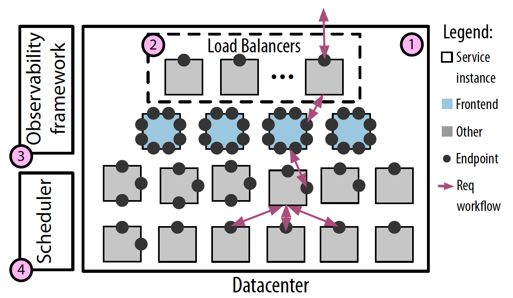
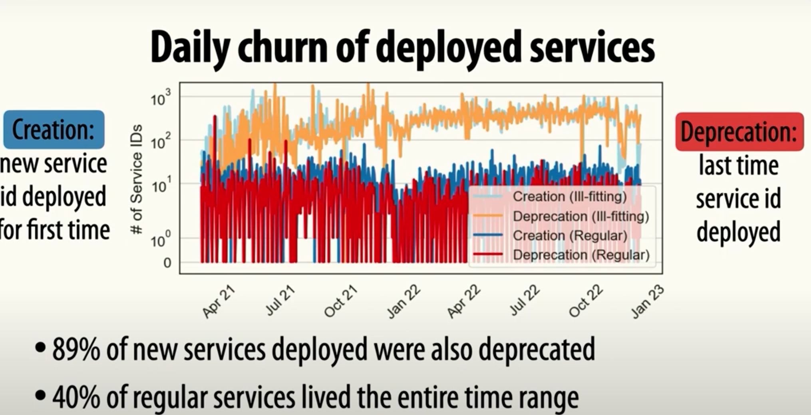

1. Production traces used in their paper having Meta’s microservice topology and request workflows: https://github.com/facebookresearch/distributed_traces.
2. Main findings: 
- Workload characteristics: Traces are small in size and wide in number of communication calls.
- Service and endpoint names do not predict number of communication calls or their concurrency.
3. Meta’s microservice architecture: 
- Interconnected, replicated software services running in dozens of datacenters
- Load balancers [Requests can be load balanced to instances within the same datacenter or to instances in different datacenters. Only the datacenter load balancer is shown in the figure.]
- Observability framework [monitoring the topology and creating traces] 
- A globally-federated scheduler for running services on host machines within containers
 
4. How do applications use Meta’s microservice architecture? 
- Apps issue requests -> that are load balanced by DNS to specific datacenters -> then processed by a subset of the architecture’s software services
5. In this architecture the notion of an application is ill-defined.
5. Not so many papers studies microservice topologies: like how the topology evolves
or the velocity of changes. These aspects are apparently only studied in this work and also [ByteDance](https://onlinelibrary.wiley.com/doi/abs/10.1002/smr.2467)
6. Each service in the application could be stateless or statefull [like databases].
7. Most services at Meta use two-way Thrift RPCs.
8. The set of services involved in a request workflow depends on: business logic + whether any requested data is cached.[the specific set of instances involved in a request workflow depends on the current load and the load-balancing policy though.]
9. Parent-child request calls among services:
- Sequentially: blocking calls or data dependencies between services [all of them are in the critical path]
- Concurrently: only the slowest service is in the critical path 
10. Meta’s microservice topology contains three types of software entities that communicate within and amongst one another
- those that represent a single, well-scoped business use case.
- those that serve many different business cases but are deployed as a signle service
- ill-suited to the microservice architecture’s expectations [not a single service?]
11. Ill-fitting services were those that had unique names (each service) but they were essentially one big platform that were creating those sub-services! (make sure this is correct though) [in the whole data there is much of ill-fitting data that makes the analysis kinda hard, and the previous works also it's not clear if the same behaviour is seen]
12. Topology of services is very complex [and the overall topology of connected services does not show a power-law relationship typical of many large-scale networks.] but the number of endpoints services expose does show a power-law relationship.
13. They reported that the topology has scaled rapidly. this is an increase in number of services (i.e., new functionality) rather than increased replication of existing ones (i.e., additional instances). 
14. ill-fitting services -> skew instance counts so much! [a high number of services counted diffeernt but essentially the same thing]
15. Services are sparsely interconnected.
16. Services are called by services more than they call other services.
17. Most services are simple, exposing only a few endpoints
18. Service complexity follows a power-law distribution: Meaning: most services are simple with a long tail of more complex services.
19. The service dependency diagram does not follow a power law distribution -> Meaning: services with more endpoints are not proportionally more connected to the topology than services with fewer endpoints. 
20. Instances’ rate of increase is due to new business use cases rather than increased scale.[more users really getting to add services]
21. Lots of churn in services, with both long-lived and ephemeral ones: rates of quick deprecations. 
22. Request workflows characteristics: 
- Trace sizes are mostly small [only a few service blocks]
- Traces are wide and not deep [calling many services at once instead of a caller/callee thing] 
- Root Ingress IDs do not predict trace properties. [like given an id of a service, you can't well-predict the RPCs that it's gonna make? ]
- Many call paths in the traces are prematurely terminated due to rate limiting, dropped records, or non-instrumented services. [unrecoverable call paths]
23. There is significant diversity in trace sizes. In general, traces are shallow and wide: Large traces are a result of the number of calls made by services, not depth of calls. -> Reason: could be data sharding, where retrieving a collection of items requires fanning out requests across many storage service instances.
24. Service reuse within traces is high and occurs at many different call depths

Implications for testbeds and benchmarks: 
- Future testbeds should include concurrency, number of children, and set of children that are executed as dimensions of variability in request workflows.

Implications for microservice tooling: 
- Services and the topology it self are very dynamic and changing: Periodic retraining may be necessary; mechanisms are needed to identify when predictions diverge from the ground truth due to stale topological information. 
- Many workflow properties can be predicted when they are broken down into fundamental building blocks (like parent/child relationships).

Need for artificial microservice topology & workflow generators: 
- there is only one right now doing this [Characterizing microservice dependency
and performance: Alibaba trace analysis](https://dl.acm.org/doi/abs/10.1145/3472883.3487003)  
- potential research directions: 
   (a) which dimensions of microservice architectures are best explored in testbeds versus artificial topology or workflow generators? 
   (b) how to ensure these dimensions are representative of a variety of large-scale organizations’ characteristics?

How to better incorporate ill-fitting software entities into microservice architecture? [I need to read more about the ill-fitting things again]
- Should infrastructure platforms provide richer interfaces to allow scheduling, scaling, and observability based on additional dimensions rather than only one?

- they found that organizations’ architectures have similar architectural
diagrams and use custom versions of the same architectural components or open-source versions. 
- overall, they found that more detailed quantitative comparisons is impossible due to divergent (or ill-specified) definitions in previous studies and because different studies use custom measurement techniques specific to their observability
frameworks. 
- There is a need to develop rich, well-accepted methodologies for collecting data about microservice architectures to systematize similarities and differences across them. [like IMC]

---------------------------------------------------------

Notes from their presentation:

Curent State of micro-service research:
- Microservice testbeds [DeathStarBench + train ticket] -> Small in scale and complexity
- Tools evaluated on these testbeds
   - Focus on topology and request flows
   - Example: Sage -> resource management using topological information
   - Example: TProf -> Aggregate analysis of request workflows

- the question here is that "How relaistics are the test beds and the abstractions that we assume on microservices?"

The summary of their findings: 

Their analysis granularity -> service_id [a unique name for each service]

The following figure shows that there is a high fluctuation in the number of microservices deployed at Meta in a 22 month period. [but then turned out 60% of the ids were of the same format inference_platform+[some random string] where X was constant] -> basically each service_id was for a different model, tenant info is included in the service_id to utilize infrastructure support. (they want scalability for each of their models seperately) 

Takeaway from this: service granularity is not sufficiant for all management tasks: at least multi-tenancy and data placement must be considered.

There is also some amount of daily churn [the services getting created and deprecated in a short time]. Most of the deprecations over the time was from "inference_platform". (models getting created as a service and then shortly after getting removed)

There also seems to be a growing number of services getting deployed at meta [and these are new services with new functionalities and not due to scaling the existing services]

Meta's distributed tracing framework -> Canopy [SOSP'17 ]
- tracing has blocks [execution time of a portion of the worfklow / functions] and points [which are specific points in time that are connected to each other via edges]

then they look at the workflow properties [request trajectories]. Here is what they are looking at assuming each pair of caller/callee (parent/child). 

Now the question is: "Can we predict the number of children?" -> Knowing how many microservices (and maybe which) are going to be executed after a request is recieved in a single microservice. -> the majority of services make few calls [shallow ]

Then looking deeper into the number of relays of each parent node in three traces, here is the variability of them:

- Variation in the number of relays could be due to: 
1. Different children sets [different higher level behaviours] -> when there are clusters of invocations around the same number of calls (y-axis)
2. when there is no clusters and a lot of variations in the number calls [those long bars in the plot] -> due to database accesses, data is sharded in different database instances, and the number of calls you're making depends on which data is stored where [potentially an interesting behaviour to look into]

Another analysis they did was "predicting concurrency rates of variable relays" 

Here the x-axis is the 5 most common services in Ads, and then the invocations for each of them are being shown. The x_axis is the concurrency rate (0 means all children were sequential, and 1 means all children was concurrent)
- again we see for some of the services, the concurrency rates are clustered and for some it's highly variable.

The analysis on the plot is as below: 

Takeaway -> Children set provide visibility into code logic, explaining dependencies.

Implications of their findings:
1. Testbeds shoud be extended to support for 
- Heterogeneity of services, churn 
- variable concurrency, number of children, and children sets 

2. Tooling that uses topology for resource management -> should be able to adapt to highly dynamic topology [even in a daily basis]

3. Tooling that uses workflows for performance prediction, diagnosis, capacity planning 
-> should assume significant diversity in workflows
